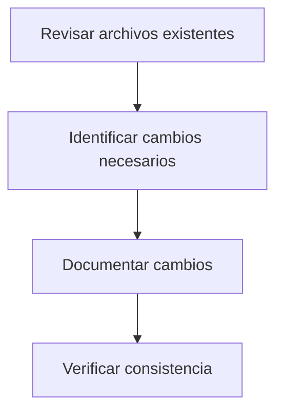

# Guía de Contribución al Memory Bank

## 📜 Principios Generales

1. **Preservación del historial**

   - Mantener registro completo de todos los cambios
   - Nunca eliminar contenido, solo marcar como obsoleto cuando sea necesario

2. **Adiciones incrementales**

   - Actualizaciones pequeñas y frecuentes
   - Cada cambio significativo debe documentarse por separado

3. **Organización cronológica**
   - Ordenar entradas por fecha (más reciente primero)
   - Usar formato YYYY-MM-DD para consistencia

## 🔄 Proceso de Actualización



1. **Revisar contenido existente**

   - Verificar archivos relacionados
   - Identificar dependencias

2. **Agregar nuevas entradas**

   - Usar formato estándar
   - Incluir todos los detalles relevantes

3. **Mantener estructura temporal**
   - Agrupar cambios por fecha
   - Usar encabezados claros

## 📝 Formato de Documentación

### Estructura de secciones

```markdown
### YYYY-MM-DD - [Tipo de cambio]

- **Autor**: [Nombre]
- **Descripción**: [Detalles del cambio]
- **Archivos afectados**:
  - [archivo1.md]
  - [archivo2.md]
- **Relacionado con**:
  - #[issue-number]
  - [otro-cambio.md]
```

### Tipos de cambios

- `feature`: Nueva funcionalidad/documentación
- `update`: Mejora a existente
- `fix`: Corrección de error
- `deprecate`: Marcado como obsoleto

## 🏆 Ejemplos Prácticos

### Ejemplo correcto ✅

```markdown
### 2025-04-10 - feature

- **Autor**: María García
- **Descripción**: Añadida documentación inicial del sistema de notificaciones
- **Archivos afectados**:
  - memory-bank/notifications-system.md
  - memory-bank/activeContext.md
- **Relacionado con**:
  - #45
  - systemPatterns.md#notifications
```

### Ejemplo incorrecto ❌

```markdown
Actualicé algunos archivos con cosas nuevas
```

## 🔖 Sistema de Versionado

1. **Versiones semanales**

   - Formato: `vYYYY.MM.WW`
   - Ejemplo: `v2025.04.02`

2. **Etiquetado**

   - `major`: Cambios importantes/rupturas
   - `minor`: Nuevas características
   - `patch`: Correcciones menores

3. **Registro de versiones**  
   Mantener en `memory-bank/CHANGELOG.md`:
   ```markdown
   ## [v2025.04.02] - 2025-04-10

   ### Added

   - Documentación inicial del sistema de notificaciones
   ```
