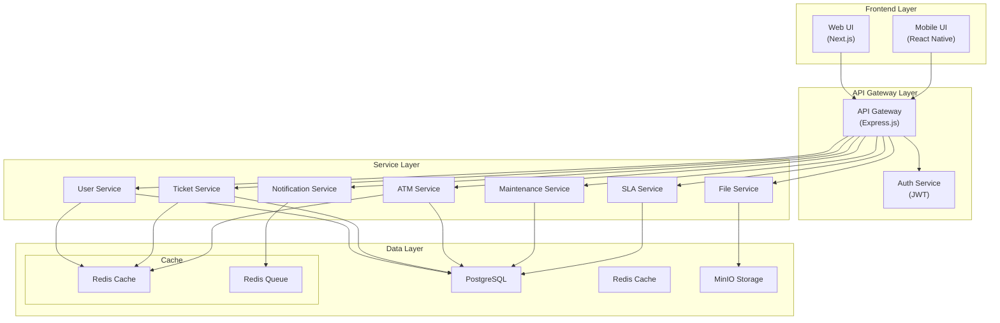
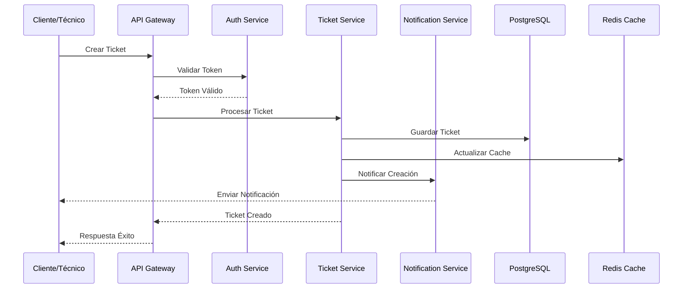
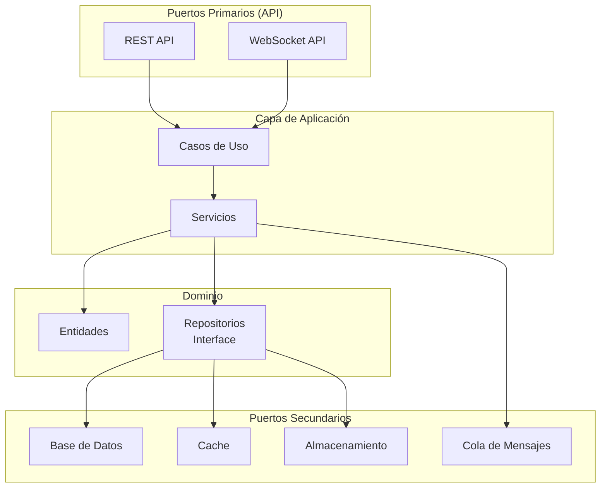
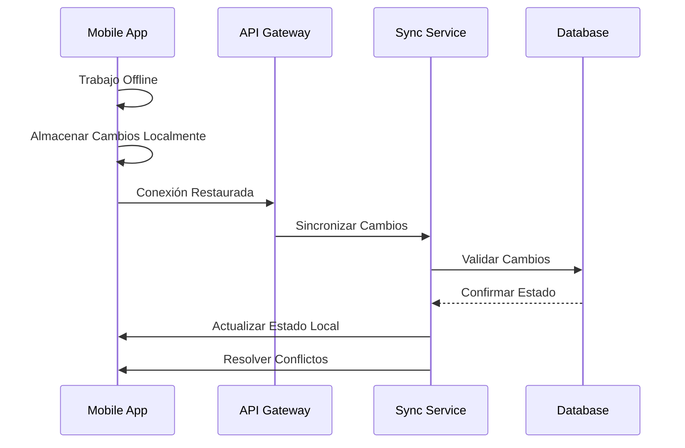
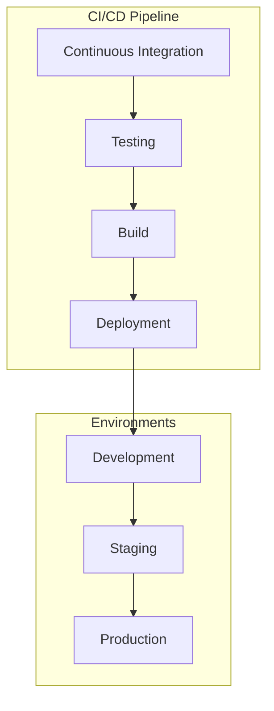

# Diseño de Arquitectura - Sistema CMMS

## Diagrama de Componentes

## Diagrama de Flujo de Datos - Gestión de Tickets

## Arquitectura Hexagonal del Backend

## Patrón de Integración - Sincronización Offline

## Arquitectura de Microservicios

### User Service

- Gestión de usuarios y roles
- Autenticación y autorización
- Perfiles y preferencias

### Ticket Service

- Creación y gestión de tickets
- Asignación y seguimiento
- Historial y estados

### ATM Service

- Registro y gestión de ATMs
- Ubicación y estado
- Especificaciones técnicas

### Maintenance Service

- Registros de mantenimiento
- Programación de mantenimiento
- Historial de servicios

### Notification Service

- Notificaciones por email
- Notificaciones push
- Alertas del sistema

### SLA Service

- Configuración de SLAs
- Monitoreo de cumplimiento
- Reportes de nivel de servicio

### File Service

- Gestión de archivos
- Almacenamiento en MinIO
- Procesamiento de imágenes

## Consideraciones Técnicas

### Seguridad

- JWT para autenticación
- HTTPS para todas las comunicaciones
- Validación de entrada en todos los endpoints
- Sanitización de datos
- Rate limiting
- CORS configurado adecuadamente

### Escalabilidad

- Servicios stateless
- Cache distribuido con Redis
- Balanceo de carga
- Replicación de base de datos
- Arquitectura basada en eventos

### Disponibilidad

- Healthchecks en todos los servicios
- Circuit breakers
- Fallback strategies
- Monitoreo continuo
- Logs centralizados

### Performance

- Optimización de queries
- Índices en base de datos
- Caché en múltiples niveles
- Compresión de respuestas
- Lazy loading
- Paginación

### Mantenibilidad

- Código modular
- Pruebas automatizadas
- Documentación actualizada
- Versionado de APIs
- Logs estructurados

## Estrategia de Despliegue

