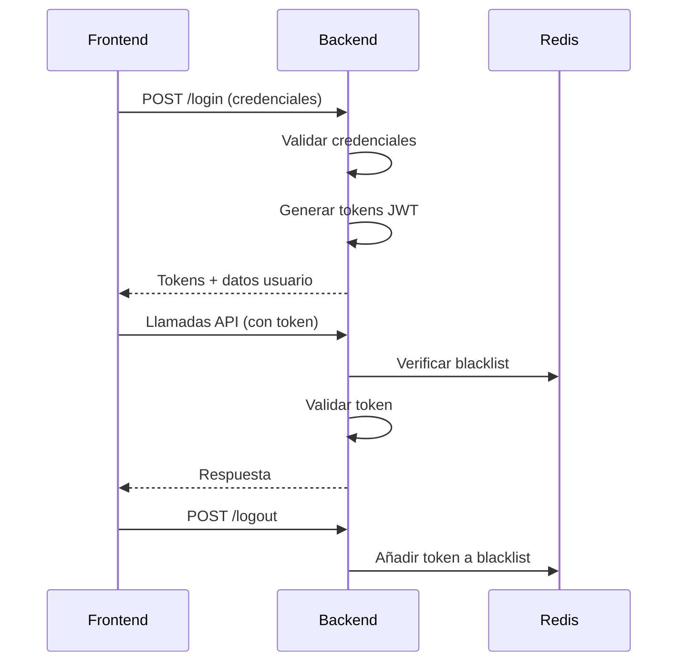

# Sistema de Autenticación

## Diagrama de Flujo

## Componentes Principales

### Backend

1. **AuthService**

   - Login/logout
   - Validación de tokens
   - Refresco de tokens

2. **JwtService**

   - Generación/verificación de tokens
   - Configuración de expiración

3. **TokenBlacklistService**

   - Gestión de tokens invalidados
   - Integración con Redis

4. **AuthMiddleware**
   - Protección de rutas
   - Control de roles/permisos

### Frontend

1. **AuthContext**
   - Estado global de autenticación
   - Persistencia en localStorage
   - Integración con API

## Patrones de Seguridad

1. **JWT**

   - Access tokens (corta duración)
   - Refresh tokens (larga duración)
   - Firmados con clave secreta

2. **Blacklist**

   - Tokens invalidados
   - Expiración automática

3. **Validaciones**
   - Usuario activo
   - Credenciales válidas
   - Roles/permisos

## Decisiones Técnicas

1. **Arquitectura**

   - Separación clara de responsabilidades
   - Inyección de dependencias
   - DTOs para transferencia de datos

2. **Seguridad**

   - No almacenamiento de passwords en texto plano
   - HTTPS obligatorio
   - Headers de seguridad

3. **Performance**
   - Cache en Redis
   - Índices en base de datos
   - Validación eficiente de tokens

## Mejoras Futuras

1. Implementar MFA (Autenticación Multifactor)
2. Añadir logs de auditoría
3. Soporte para OAuth/SSO
4. Rate limiting para endpoints sensibles
