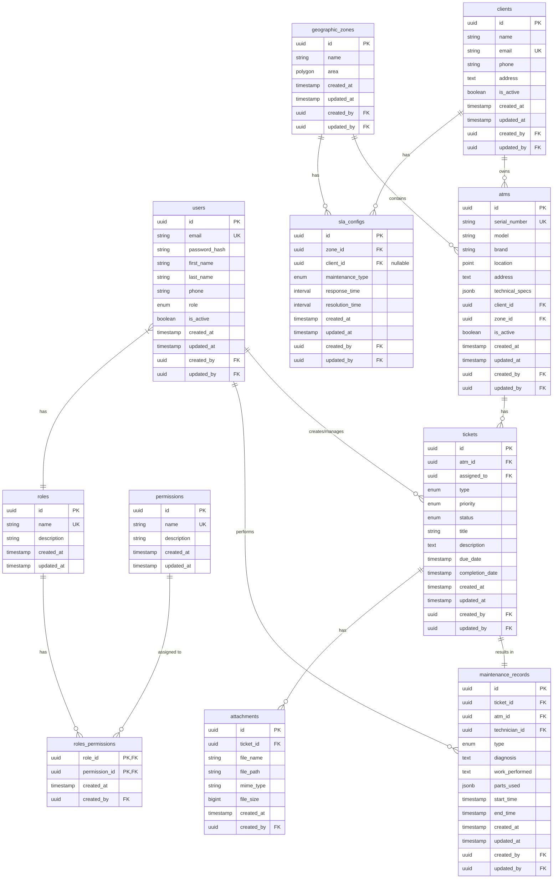

# Diseño de Base de Datos - Sistema CMMS

## Diagrama ERD

## Definición de Tablas

### users

Almacena información de todos los usuarios del sistema.

- `id`: UUID, PK
- `email`: string, UK, email del usuario
- `password_hash`: string, hash de la contraseña
- `first_name`: string, nombre
- `last_name`: string, apellido
- `phone`: string, teléfono de contacto
- `role`: enum ('admin', 'operator', 'technician', 'client')
- `is_active`: boolean, estado del usuario
- `created_at`: timestamp
- `updated_at`: timestamp
- `created_by`: UUID, FK a users
- `updated_by`: UUID, FK a users

### roles

Almacena los roles del sistema.

- `id`: UUID, PK
- `name`: string, UK, nombre del rol
- `description`: string, descripción del rol
- `created_at`: timestamp
- `updated_at`: timestamp

### permissions

Almacena los permisos disponibles.

- `id`: UUID, PK
- `name`: string, UK, nombre del permiso
- `description`: string, descripción del permiso
- `created_at`: timestamp
- `updated_at`: timestamp

### roles_permissions

Tabla de relación entre roles y permisos.

- `role_id`: UUID, PK, FK a roles
- `permission_id`: UUID, PK, FK a permissions
- `created_at`: timestamp
- `created_by`: UUID, FK a users

### atms

Almacena información de los cajeros automáticos.

- `id`: UUID, PK
- `serial_number`: string, UK, número de serie
- `model`: string, modelo del ATM
- `brand`: string, marca del ATM
- `location`: point, coordenadas geográficas
- `address`: text, dirección física
- `technical_specs`: jsonb, especificaciones técnicas
- `client_id`: UUID, FK a clients
- `zone_id`: UUID, FK a geographic_zones
- `is_active`: boolean, estado del ATM
- `created_at`: timestamp
- `updated_at`: timestamp
- `created_by`: UUID, FK a users
- `updated_by`: UUID, FK a users

### clients

Almacena información de los clientes.

- `id`: UUID, PK
- `name`: string, nombre del cliente
- `email`: string, UK, email del cliente
- `phone`: string, teléfono de contacto
- `address`: text, dirección
- `is_active`: boolean, estado del cliente
- `created_at`: timestamp
- `updated_at`: timestamp
- `created_by`: UUID, FK a users
- `updated_by`: UUID, FK a users

### geographic_zones

Almacena las zonas geográficas de servicio.

- `id`: UUID, PK
- `name`: string, nombre de la zona
- `area`: polygon, área geográfica
- `created_at`: timestamp
- `updated_at`: timestamp
- `created_by`: UUID, FK a users
- `updated_by`: UUID, FK a users

### tickets

Almacena los tickets de mantenimiento.

- `id`: UUID, PK
- `atm_id`: UUID, FK a atms
- `assigned_to`: UUID, FK a users (técnicos)
- `type`: enum ('preventive', 'corrective', 'visit')
- `priority`: enum ('low', 'medium', 'high', 'critical')
- `status`: enum ('open', 'assigned', 'in_progress', 'resolved', 'closed')
- `title`: string, título del ticket
- `description`: text, descripción del problema
- `due_date`: timestamp, fecha límite
- `completion_date`: timestamp, fecha de completación
- `created_at`: timestamp
- `updated_at`: timestamp
- `created_by`: UUID, FK a users
- `updated_by`: UUID, FK a users

### maintenance_records

Almacena los registros de mantenimiento.

- `id`: UUID, PK
- `ticket_id`: UUID, FK a tickets
- `atm_id`: UUID, FK a atms
- `technician_id`: UUID, FK a users
- `type`: enum ('first_line', 'second_line', 'visit')
- `diagnosis`: text, diagnóstico
- `work_performed`: text, trabajo realizado
- `parts_used`: jsonb, partes utilizadas
- `start_time`: timestamp, inicio del trabajo
- `end_time`: timestamp, fin del trabajo
- `created_at`: timestamp
- `updated_at`: timestamp
- `created_by`: UUID, FK a users
- `updated_by`: UUID, FK a users

### attachments

Almacena los archivos adjuntos a tickets.

- `id`: UUID, PK
- `ticket_id`: UUID, FK a tickets
- `file_name`: string, nombre del archivo
- `file_path`: string, ruta en MinIO
- `mime_type`: string, tipo MIME
- `file_size`: bigint, tamaño en bytes
- `created_at`: timestamp
- `created_by`: UUID, FK a users

### sla_configs

Almacena las configuraciones de SLA.

- `id`: UUID, PK
- `zone_id`: UUID, FK a geographic_zones
- `client_id`: UUID, FK a clients (nullable)
- `maintenance_type`: enum ('first_line', 'second_line', 'visit')
- `response_time`: interval, tiempo de respuesta
- `resolution_time`: interval, tiempo de resolución
- `created_at`: timestamp
- `updated_at`: timestamp
- `created_by`: UUID, FK a users
- `updated_by`: UUID, FK a users

## Índices

### Índices Primarios

- `pk_users` en users(id)
- `pk_roles` en roles(id)
- `pk_permissions` en permissions(id)
- `pk_roles_permissions` en roles_permissions(role_id, permission_id)
- `pk_atms` en atms(id)
- `pk_clients` en clients(id)
- `pk_geographic_zones` en geographic_zones(id)
- `pk_tickets` en tickets(id)
- `pk_maintenance_records` en maintenance_records(id)
- `pk_attachments` en attachments(id)
- `pk_sla_configs` en sla_configs(id)

### Índices Únicos

- `ux_users_email` en users(email)
- `ux_atms_serial_number` en atms(serial_number)
- `ux_clients_email` en clients(email)
- `ux_roles_name` en roles(name)
- `ux_permissions_name` en permissions(name)

### Índices de Búsqueda

- `ix_tickets_status` en tickets(status)
- `ix_tickets_assigned_to` en tickets(assigned_to)
- `ix_tickets_atm_id` en tickets(atm_id)
- `ix_maintenance_records_ticket_id` en maintenance_records(ticket_id)
- `ix_maintenance_records_technician_id` en maintenance_records(technician_id)
- `ix_attachments_ticket_id` en attachments(ticket_id)
- `ix_atms_location` usando GIST en atms(location)
- `ix_geographic_zones_area` usando GIST en geographic_zones(area)

## Restricciones

### Integridad Referencial

- Todas las claves foráneas tienen restricción ON DELETE RESTRICT
- Las columnas created_by y updated_by tienen ON DELETE SET NULL

### Check Constraints

- `ck_users_email_format`: Validación de formato de email
- `ck_users_phone_format`: Validación de formato de teléfono
- `ck_maintenance_records_timestamps`: start_time debe ser anterior a end_time
- `ck_tickets_dates`: due_date debe ser posterior a created_at

## Consideraciones de Rendimiento

1. Particionamiento

   - Tabla tickets particionada por rango de fechas
   - Tabla maintenance_records particionada por rango de fechas

2. Materialized Views

   - mv_atm_maintenance_stats: Estadísticas de mantenimiento por ATM
   - mv_technician_performance: Métricas de rendimiento de técnicos

3. Vacuumming

   - Configurar autovacuum para tablas con alta frecuencia de actualización
   - Programar vacuum full mensual para tablas grandes

4. Cacheo
   - Implementar cache en Redis para:
     - Configuraciones de SLA
     - Datos de ATMs activos
     - Tickets en proceso
     - Estadísticas del dashboard
