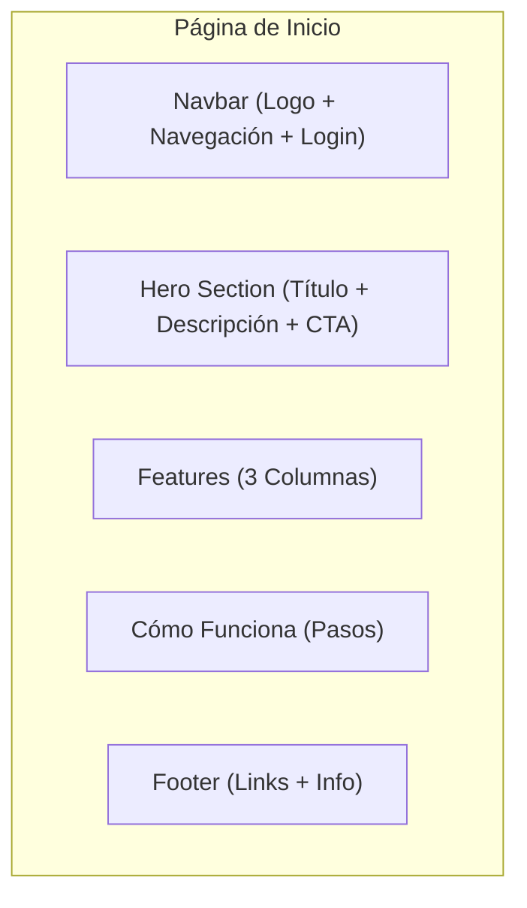

# Diseño de Página de Inicio Pública - Sistema CMMS

## 1. Objetivo

Proporcionar una página de inicio clara y profesional para el sistema CMMS de mantenimiento de ATMs, enfocada en:

- Presentar las funcionalidades clave
- Permitir acceso rápido a login/registro
- Comunicar el valor profesional del sistema

## 2. Estructura de Componentes

## 3. Secciones Detalladas

### 3.1. Navbar Superior

**Componentes:**

- Logo del sistema (SVG)
- Menú minimalista:
  - Inicio
  - Características
- Botones alineados a la derecha:
  - "Iniciar Sesión" (variante outline)
  - "Registrarse" (variante primary)

### 3.2. Hero Section

**Contenido:**

- Título principal: "Sistema CMMS para Mantenimiento de ATMs"
- Subtítulo: "Solución especializada para gestión de mantenimiento preventivo y correctivo"
- Acciones:
  - Botón "Iniciar Sesión" (primary)
  - Botón "Registrarse" (secondary)
- Imagen de fondo: Ilustración técnica de ATM con interfaz de sistema

### 3.3. Features (3 Columnas)

**Diseño en grid responsivo:**

1. **Gestión de Tickets**

   - Icono: 🎫
   - Título: "Ticketing Centralizado"
   - Descripción: "Sistema completo para creación, asignación y seguimiento de tickets"

2. **Seguimiento de ATMs**

   - Icono: 🏧
   - Título: "Registro de Equipos"
   - Descripción: "Base de datos centralizada con historial completo de mantenimientos"

3. **Cumplimiento SLA**
   - Icono: ⏱️
   - Título: "Monitoreo de SLAs"
   - Descripción: "Seguimiento de tiempos de respuesta garantizados"

### 3.4. Cómo Funciona (Pasos)

**Listado vertical numerado:**

1. **Autenticación**

   - Registro de usuarios técnicos/administradores
   - Login seguro con JWT

2. **Configuración Inicial**

   - Registro de flota de ATMs
   - Definición de SLAs y zonas geográficas

3. **Operación Diaria**

   - Creación y gestión de tickets
   - Asignación a técnicos

4. **Monitoreo**
   - Dashboard de métricas
   - Reportes de cumplimiento

### 3.5. Footer

**Contenido mínimo:**

- Enlaces rápidos:
  - Política de Privacidad
  - Términos de Servicio
- Información legal:
  - © 2025 Sistema CMMS
  - Versión 2.0

## 4. Directrices de Implementación

### 4.1. Tecnología

- Next.js 14 (App Router)
- Tailwind CSS para estilos
- Componentes reutilizables de la librería existente

### 4.2. Componentes a Reutilizar

- `Button` (variantes primary/secondary/outline)
- `Card` (para features)
- `Input` (formulario de login/registro)
- `Layout` (estructura base)

### 4.3. Rutas

- `/home` - Landing page pública
- `/` - Redirige a dashboard (logueado) o /home (no logueado)

## 5. Consideraciones de Diseño

### 5.1. Estilo Visual

- **Colores:**
  - Primario: Azul (#2563eb)
  - Neutral: Grises (#f1f5f9, #64748b)
- **Tipografía:** Inter (sans-serif)
- **Espaciado:** Sistema de 4px (0.25rem increments)

### 5.2. Responsive

- Breakpoints:
  - Mobile: <768px (columnas apiladas)
  - Desktop: ≥768px (grid de 3 columnas para features)

### 5.3. Performance

- Imágenes optimizadas (WebP)
- Lazy loading para imágenes
- Static Site Generation (SSG)
