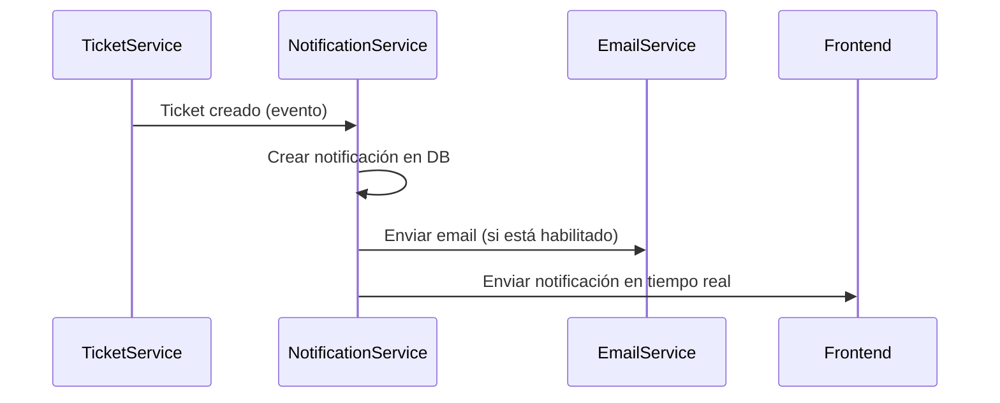

# Diseño del Sistema de Notificaciones

## 1. Tipos de Notificaciones

- **Notificaciones en la aplicación**: Mostradas en la interfaz de usuario
- **Notificaciones por email**: Enviadas a la dirección registrada del usuario
- **Notificaciones push (futuro)**: Para implementación móvil

## 2. Estructura de Datos

### Entidad Notification

```typescript
@Entity("notifications")
export class Notification {
  @PrimaryGeneratedColumn("uuid")
  id!: string;

  @Column({ type: "varchar" })
  type!: "email" | "in_app" | "push";

  @Column({ type: "varchar" })
  title!: string;

  @Column({ type: "text" })
  content!: string;

  @Column({ type: "boolean", default: false })
  is_read!: boolean;

  @Column({ type: "uuid" })
  user_id!: string;

  @Column({ type: "jsonb", nullable: true })
  metadata?: Record<string, unknown>;

  @CreateDateColumn({ type: "timestamp" })
  created_at!: Date;
}
```

### Modificación a User Entity

```typescript
@Column({ type: "jsonb", default: {
  email_notifications: true,
  in_app_notifications: true,
  push_notifications: false
}})
notification_preferences!: {
  email_notifications: boolean;
  in_app_notifications: boolean;
  push_notifications: boolean;
};
```

## 3. Servicios y Endpoints

### Servicio de Notificaciones

```typescript
class NotificationService {
  async create(notification: CreateNotificationDto): Promise<Notification>;
  async markAsRead(notificationId: string): Promise<Notification>;
  async getUserNotifications(userId: string): Promise<Notification[]>;
  async sendEmailNotification(email: string, content: string): Promise<void>;
}
```

### Endpoints

- `POST /notifications` - Crear notificación
- `GET /notifications` - Listar notificaciones del usuario
- `PATCH /notifications/:id/read` - Marcar como leída
- `PUT /users/:id/notification-preferences` - Actualizar preferencias

## 4. Integración con Sistema Existente

### Eventos que generarán notificaciones:

1. Creación/actualización de tickets
2. Asignación de tickets
3. Cambio de estado de tickets
4. Comentarios en tickets
5. Recordatorios de tickets próximos a vencer

### Diagrama de Secuencia:



## 5. Patrones de Diseño

1. **Observer Pattern**: Para notificar a múltiples canales (email, in-app) cuando ocurre un evento
2. **Strategy Pattern**: Para diferentes métodos de envío (email, push, etc.)
3. **Factory Method**: Para crear diferentes tipos de notificaciones
4. **Decorator Pattern**: Para añadir funcionalidades adicionales (ej: logging, métricas)
