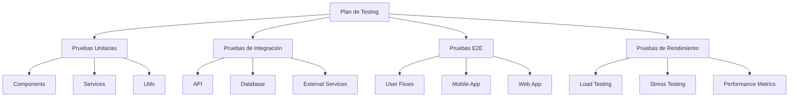

# Plan de Pruebas - Sistema CMMS

## Estrategia de Testing

### Niveles de Prueba



## 1. Pruebas Unitarias

### Configuración del Ambiente de Pruebas

#### Base de Datos de Pruebas

La base de datos de pruebas se configura mediante los siguientes componentes:

1. Variables de Entorno (.env.test):

```env
TEST_DB_HOST=localhost
TEST_DB_PORT=5432
TEST_DB_USER=cmms_user
TEST_DB_PASS=cmms_password2
TEST_DB_NAME=mante_test
```

2. Scripts de Gestión:

```bash
# Inicializar base de datos de pruebas
npm run test:db:init

# Limpiar datos de prueba
npm run test:db:clean

# Ejecutar pruebas de integración (incluye inicialización de BD)
npm run test:integration
```

3. Utilidades (database-test.utils.ts):

- createTestDatabase(): Crea y configura la base de datos de pruebas
- clearDatabase(): Limpia todas las tablas
- closeDatabase(): Cierra la conexión
- withTestDatabase(): Wrapper para pruebas que requieren BD

### Frontend Web y Móvil

```typescript
// Ejemplo de prueba de componente
describe("TicketCard Component", () => {
  it("should render ticket information correctly", () => {
    const ticket = {
      id: "123",
      title: "ATM Error",
      priority: "high",
      status: "open",
    };

    render(<TicketCard ticket={ticket} />);
    expect(screen.getByText("ATM Error")).toBeInTheDocument();
    expect(screen.getByText("high")).toBeInTheDocument();
  });
});

// Ejemplo de prueba de hook
describe("useTicket Hook", () => {
  it("should fetch ticket data", async () => {
    const ticketId = "123";
    const { result } = renderHook(() => useTicket(ticketId));

    await waitFor(() => {
      expect(result.current.data).toBeDefined();
    });
  });
});
```

### Backend

```typescript
// Ejemplo de prueba de servicio
describe("TicketService", () => {
  it("should create a ticket", async () => {
    const ticketData = {
      title: "New Issue",
      atmId: "456",
      priority: "high",
    };

    const result = await ticketService.create(ticketData);
    expect(result).toHaveProperty("id");
    expect(result.title).toBe("New Issue");
  });
});

// Ejemplo de prueba de utilidad
describe("SLACalculator", () => {
  it("should calculate response time correctly", () => {
    const priority = "high";
    const zone = "urban";

    const responseTime = SLACalculator.getResponseTime(priority, zone);
    expect(responseTime).toBe(3600); // 1 hora en segundos
  });
});
```

## 2. Pruebas de Integración

### API Endpoints

```typescript
describe("Ticket API", () => {
  it("should create and retrieve a ticket", async () => {
    // Crear ticket
    const response = await request(app).post("/api/v1/tickets").send({
      title: "Test Ticket",
      atmId: "789",
      priority: "high",
    });

    expect(response.status).toBe(201);
    const ticketId = response.body.data.id;

    // Obtener ticket creado
    const getResponse = await request(app).get(`/api/v1/tickets/${ticketId}`);

    expect(getResponse.status).toBe(200);
    expect(getResponse.body.data.title).toBe("Test Ticket");
  });
});
```

### Base de Datos

```typescript
describe("Database Integration", () => {
  it("should handle ticket-maintenance relationship", async () => {
    // Crear ticket y registro de mantenimiento
    const ticket = await Ticket.create({
      /*...*/
    });
    const maintenance = await Maintenance.create({
      ticketId: ticket.id,
      /*...*/
    });

    // Verificar relaciones
    const ticketWithMaintenance = await Ticket.findByPk(ticket.id, {
      include: [Maintenance],
    });

    expect(ticketWithMaintenance.maintenances).toHaveLength(1);
  });
});
```

## 3. Pruebas E2E

### Flujos de Usuario Web

```typescript
describe("Ticket Management Flow", () => {
  it("should complete full ticket lifecycle", async () => {
    // Login
    await page.goto("/login");
    await page.fill('[data-testid="email"]', "tech@example.com");
    await page.fill('[data-testid="password"]', "password123");
    await page.click('[data-testid="login-button"]');

    // Crear ticket
    await page.goto("/tickets/new");
    await page.fill('[data-testid="ticket-title"]', "E2E Test Ticket");
    await page.selectOption('[data-testid="priority"]', "high");
    await page.click('[data-testid="submit-ticket"]');

    // Verificar creación
    await expect(page.locator('[data-testid="success-message"]')).toBeVisible();

    // Completar mantenimiento
    await page.click('[data-testid="start-maintenance"]');
    await page.fill('[data-testid="maintenance-notes"]', "Work completed");
    await page.click('[data-testid="complete-maintenance"]');

    // Verificar estado final
    await expect(page.locator('[data-testid="status"]')).toHaveText("closed");
  });
});
```

### Flujos de Usuario Móvil

```typescript
describe("Mobile Technician Flow", () => {
  it("should handle offline maintenance completion", async () => {
    // Simular offline
    await device.setNetworkConditions({ offline: true });

    // Completar mantenimiento offline
    await element(by.id("ticket-123")).tap();
    await element(by.id("start-work")).tap();
    await element(by.id("maintenance-notes")).typeText("Offline work");
    await element(by.id("complete-work")).tap();

    // Verificar almacenamiento local
    const storedData = await getLocalStorage("pending-sync");
    expect(storedData).toContainEqual({
      ticketId: "123",
      status: "completed",
    });

    // Restaurar conexión y verificar sincronización
    await device.setNetworkConditions({ offline: false });
    await waitFor(element(by.id("sync-complete")))
      .toBeVisible()
      .withTimeout(5000);
  });
});
```

## 4. Pruebas de Rendimiento

### Pruebas de Carga

```typescript
import { check } from "k6";
import http from "k6/http";

export const options = {
  stages: [
    { duration: "2m", target: 100 }, // Ramp up
    { duration: "5m", target: 100 }, // Stay
    { duration: "2m", target: 0 }, // Ramp down
  ],
};

export default function () {
  const response = http.get("http://api.cmms.local/api/v1/tickets");

  check(response, {
    "status is 200": (r) => r.status === 200,
    "response time < 500ms": (r) => r.timings.duration < 500,
  });
}
```

### Pruebas de Estrés

```typescript
export const options = {
  stages: [
    { duration: "2m", target: 2000 }, // Más allá de lo esperado
  ],
};

export default function () {
  const responses = http.batch([
    ["GET", "http://api.cmms.local/api/v1/tickets"],
    ["GET", "http://api.cmms.local/api/v1/atms"],
    ["POST", "http://api.cmms.local/api/v1/maintenance-records"],
  ]);

  responses.forEach((response) => {
    check(response, {
      "status is 200": (r) => r.status === 200,
    });
  });
}
```

## Métricas de Calidad

### Cobertura de Código

- Frontend: > 85% cobertura
- Backend: > 90% cobertura
- Componentes críticos: 100% cobertura

### Rendimiento

- Tiempo de respuesta API: < 200ms (p95)
- Tiempo de carga inicial web: < 2s
- Tiempo de carga inicial móvil: < 3s
- Sincronización offline: < 5s

### Calidad de Código

- Complejidad ciclomática: < 10
- Duplicación de código: < 3%
- Deuda técnica: < 5%

## Herramientas

### Frontend

- Jest
- React Testing Library
- Cypress
- Detox (mobile)

### Backend

- Jest
- Supertest
- Database Cleaner

### Performance

- k6
- Lighthouse
- React Profiler

### CI/CD

- GitHub Actions
- SonarQube
- Code Climate

## Procedimientos de QA

### Pre-release Checklist

1. Cobertura de pruebas completa
2. Pruebas de regresión ejecutadas
3. Pruebas de rendimiento aprobadas
4. Revisión de código completada
5. Documentación actualizada

### Proceso de Regresión

1. Ejecutar suite completa de pruebas
2. Verificar funcionalidades críticas
3. Validar integraciones
4. Comprobar rendimiento
5. Revisar logs y métricas

### Monitoreo Continuo

1. Alertas de errores
2. Métricas de rendimiento
3. Uso de recursos
4. Satisfacción de usuario
5. Tiempo de respuesta

## Plan de Implementación

1. Configuración de entorno CI/CD
2. Implementación de pruebas unitarias
3. Desarrollo de pruebas de integración
4. Configuración de pruebas E2E
5. Establecimiento de monitoreo continuo
6. Documentación y capacitación
