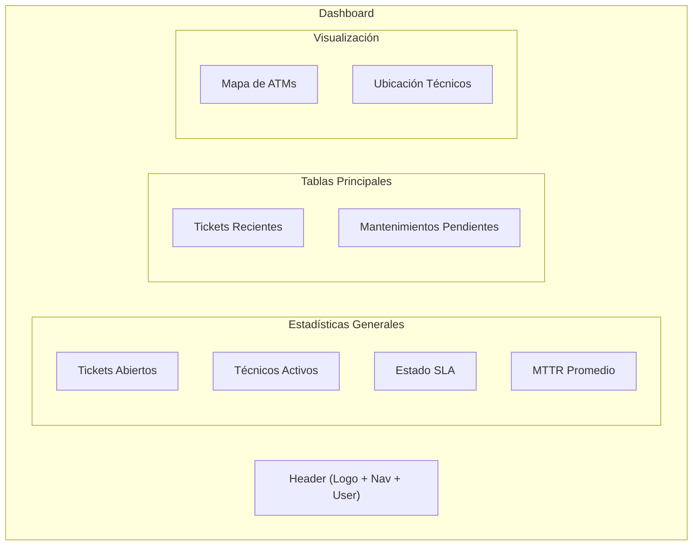
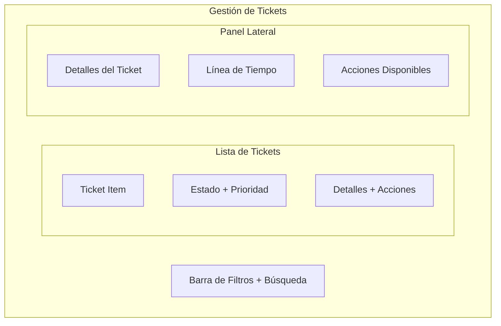
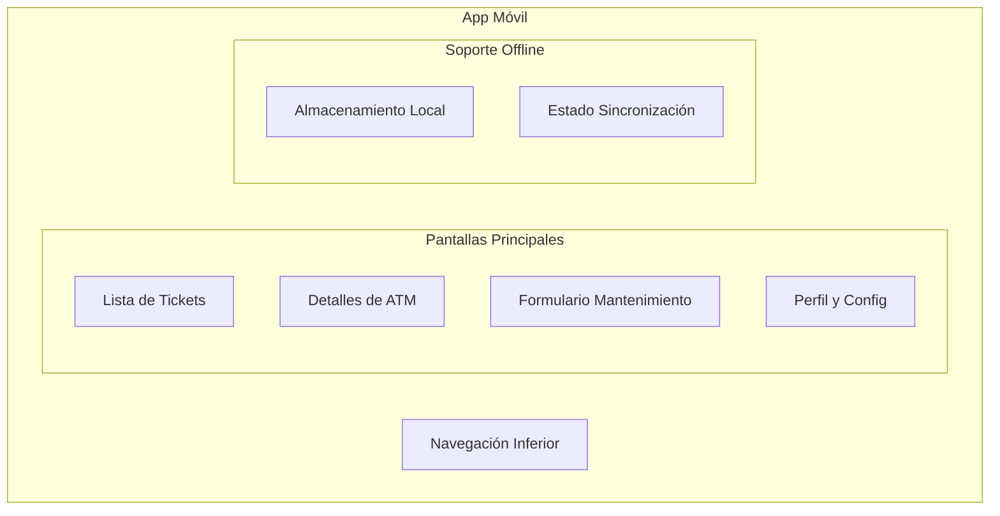

# Diseño de Interfaces de Usuario - Sistema CMMS

## Sistema de Diseño

### Paleta de Colores

```css
/* Colores Principales */
--primary: #2563eb; /* Azul principal */
--primary-dark: #1d4ed8;
--primary-light: #3b82f6;

/* Colores Secundarios */
--secondary: #475569; /* Gris azulado */
--secondary-dark: #334155;
--secondary-light: #64748b;

/* Colores de Estado */
--success: #22c55e; /* Verde */
--warning: #f59e0b; /* Amarillo */
--error: #ef4444; /* Rojo */
--info: #3b82f6; /* Azul */

/* Colores de Fondo */
--bg-primary: #ffffff;
--bg-secondary: #f8fafc;
--bg-tertiary: #f1f5f9;

/* Colores de Texto */
--text-primary: #1e293b;
--text-secondary: #475569;
--text-tertiary: #64748b;
--text-light: #ffffff;
```

### Tipografía

```css
/* Fuente Principal */
--font-primary: "Inter", sans-serif;

/* Tamaños de Fuente */
--text-xs: 0.75rem; /* 12px */
--text-sm: 0.875rem; /* 14px */
--text-base: 1rem; /* 16px */
--text-lg: 1.125rem; /* 18px */
--text-xl: 1.25rem; /* 20px */
--text-2xl: 1.5rem; /* 24px */
--text-3xl: 1.875rem; /* 30px */
```

### Espaciado

```css
/* Espaciado Base */
--spacing-xs: 0.25rem; /* 4px */
--spacing-sm: 0.5rem; /* 8px */
--spacing-base: 1rem; /* 16px */
--spacing-lg: 1.5rem; /* 24px */
--spacing-xl: 2rem; /* 32px */
--spacing-2xl: 3rem; /* 48px */
```

### Sombras

```css
/* Sombras */
--shadow-sm: 0 1px 2px 0 rgb(0 0 0 / 0.05);
--shadow-base: 0 1px 3px 0 rgb(0 0 0 / 0.1);
--shadow-md: 0 4px 6px -1px rgb(0 0 0 / 0.1);
--shadow-lg: 0 10px 15px -3px rgb(0 0 0 / 0.1);
```

### Bordes

```css
/* Bordes */
--border-radius-sm: 0.25rem;
--border-radius-base: 0.375rem;
--border-radius-lg: 0.5rem;
--border-radius-full: 9999px;
```

## Componentes Base

### Botones

```typescript
interface ButtonProps {
  variant: "primary" | "secondary" | "outline" | "ghost";
  size: "sm" | "base" | "lg";
  isLoading?: boolean;
  isDisabled?: boolean;
  leftIcon?: ReactNode;
  rightIcon?: ReactNode;
}
```

```jsx
// Ejemplos de Botones
<Button variant="primary">Acción Principal</Button>
<Button variant="secondary">Acción Secundaria</Button>
<Button variant="outline">Acción Alternativa</Button>
<Button variant="ghost">Acción Sutil</Button>
```

### Inputs

```typescript
interface InputProps {
  type: "text" | "email" | "password" | "number";
  size: "sm" | "base" | "lg";
  state?: "error" | "success";
  isDisabled?: boolean;
  leftElement?: ReactNode;
  rightElement?: ReactNode;
}
```

```jsx
// Ejemplos de Inputs
<Input type="text" placeholder="Texto normal" />
<Input type="text" state="error" errorMessage="Error en el campo" />
<Input type="text" state="success" />
```

### Cards

```typescript
interface CardProps {
  variant: "default" | "elevated" | "bordered";
  padding?: "none" | "sm" | "base" | "lg";
  isHoverable?: boolean;
}
```

```jsx
// Ejemplos de Cards
<Card variant="default">Contenido básico</Card>
<Card variant="elevated">Contenido destacado</Card>
<Card variant="bordered">Contenido enmarcado</Card>
```

## Mockups de Interfaces Principales

### Dashboard Principal



### Gestión de Tickets



### App Móvil para Técnicos



## Patrones de UX

### Navegación

1. Estructura Jerárquica

   - Dashboard como punto de entrada
   - Navegación principal en sidebar
   - Breadcrumbs para navegación profunda
   - Tabs para contenido relacionado

2. Acciones Principales
   - Botones prominentes para acciones principales
   - FAB para acciones contextuales
   - Menús desplegables para acciones secundarias

### Feedback al Usuario

1. Estados de Carga

   - Skeletons para carga inicial
   - Spinners para acciones
   - Progress bars para procesos largos

2. Notificaciones

   - Toasts para mensajes temporales
   - Banners para mensajes importantes
   - Modales para confirmaciones

3. Estados Vacíos
   - Ilustraciones informativas
   - Mensajes claros
   - Acciones sugeridas

### Formularios

1. Validación

   - Validación en tiempo real
   - Mensajes de error claros
   - Indicadores visuales de estado

2. Organización
   - Agrupación lógica de campos
   - Progressive disclosure
   - Stepper para procesos largos

### Responsive Design

1. Breakpoints

```css
--breakpoint-sm: 640px;
--breakpoint-md: 768px;
--breakpoint-lg: 1024px;
--breakpoint-xl: 1280px;
```

2. Layouts
   - Grid system flexible
   - Sidebar colapsable
   - Tablas responsivas
   - Cards adaptables

## Animaciones

```css
/* Transiciones */
--transition-base: all 0.2s ease-in-out;
--transition-smooth: all 0.3s cubic-bezier(0.4, 0, 0.2, 1);

/* Animaciones */
@keyframes fadeIn {
  from {
    opacity: 0;
  }
  to {
    opacity: 1;
  }
}

@keyframes slideIn {
  from {
    transform: translateY(20px);
    opacity: 0;
  }
  to {
    transform: translateY(0);
    opacity: 1;
  }
}
```

## Accesibilidad

1. Contraste y Color

   - Ratios de contraste WCAG 2.1
   - No depender solo del color
   - Modo oscuro soportado

2. Navegación por Teclado

   - Focus visible
   - Orden de tabulación lógico
   - Shortcuts para acciones comunes

3. Semántica
   - HTML semántico
   - ARIA labels donde necesario
   - Jerarquía clara de encabezados

## Optimizaciones de Performance

1. Carga Lazy

   - Imágenes optimizadas
   - Componentes bajo demanda
   - Datos paginados

2. Caché

   - Caché de datos en memoria
   - Almacenamiento local para offline
   - Revalidación inteligente

3. Feedback Instantáneo
   - Optimistic updates
   - Skeleton loading
   - Infinite scroll
